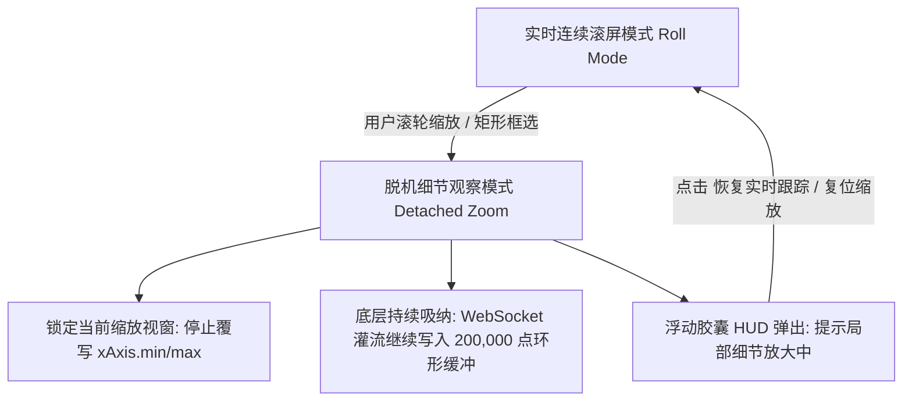

# 25_波形局部细节放大与坐标轴固定值直接设定架构实战

## 一、 用户痛点与需求还原

在软件进入实际波形压测与信号调测阶段后，用户反馈了两个高频的核心人机交互与测量痛点：

1. **细节无法放大查看**：
   > “怎么放大看这些波形的细节呢？好像默认的话，看起来是不能放大的。”
   - **现场复盘**：当多通道高速灌流（如 CH1 正弦波、CH2 方波、CH3 三角波、CH4 直流偏置叠加）在 2.0s 视窗内密集呈现时，周期紧密重叠。用户尝试通过鼠标滚轮或手势放大时，波形无法保持放大视图。
   - **底层机理分析**：
     - 在此前的高刷渲染引擎中，`renderLoop()` 在每个动画帧（60 FPS）都会根据最新时间戳 `latestT` 强行调用 `myChart.setOption({ xAxis: { min: xMin, max: xMax } })` 驱动坐标轴平滑滚屏。即使鼠标事件触发了视窗缩放，下一帧（16ms 内）就会被主循环的滚动视窗全量覆盖！
     - 原先的 `dataZoom` 交互仅在按空格键“暂停”后才开启，处于实时运行状态时处于禁用状态。

2. **横轴与纵轴固定值无法直接设定**：
   > “而且横轴和纵轴怎么设定固定的值呢？能否直接设定？比如给我一个选项，可以直接把横轴固定设为多少秒。”
   - **现场复盘**：
     - **横轴（时基 X-Axis）**：原先仅有预设下拉菜单，无法直接敲入任意数字（如用户想固定为 `0.08` 秒、`1.5` 秒、`3` 秒等精确视窗）；
     - **纵轴（量程 Y-Axis）**：原先写死为固定 `min: -10, max: 10`。当下位机送出超过 10V 的信号（例如工业 12V 供电或 24V PLC 逻辑信号，用户截图中 CH4 为 12.23V）时，波形直接被顶部截断（削顶），且界面没有直接输入电压量程的入口。

---

## 二、 架构级解决方案与技术实现

针对上述痛点，系统确立了“**多模态缩放交互 + 脱机细节无缝观察 + 坐标轴自由数值直定**”的工业仪器级解决方案：

### 1. 多模态波形细节缩放交互

- **鼠标滚轮即时缩放**：
  - **默认滚轮 (Wheel)**：实时缩放 X 轴时基，支持从毫秒级细节连续缩放到全历史视窗；
  - **Shift + 滚轮 (Shift+Wheel)**：实时缩放 Y 轴电压幅值量程；
  - **鼠标拖拽 (Drag & Pan)**：在放大状态下按住左键拖拽波形，平移查看前后时域的信号细节。
- **专业框选放大 (Box Zoom)**：
  - 工具栏提供独立的 `[🔍 框选放大]` 按钮；
  - 激活后，鼠标在波形区域化为精准十字靶心，用户只需按住左键拉出一个矩形框，ECharts 即刻对所选区域的 X 轴与 Y 轴进行高精度局部倍率放大。
- **一键复位缩放 (Reset Zoom)**：
  - 工具栏提供 `[↺ 复位缩放]` 按钮，一键清空手动缩放比例，立即无缝恢复至当前配置的标准时基与量程。

### 2. 脱机细节观察模式（Detached Zoom Inspection Mode）与后台零丢包缓冲

为彻底根除“刚放大就被 60FPS 实时滚屏冲掉”的致命缺陷，系统引入了**脱机细节观察状态机**：

- **视窗锁定**：当捕获到用户的 `dataZoom` 事件后，状态机置 `isUserZooming = true`。
- **渲染循环智能分支**：在 `renderLoop()` 中，若处于手动放大模式，只调用 `myChart.setOption({ series })` 更新当前局部视窗内的高保真采样点，**绝不覆写 `xAxis.min/max`**，用户的放大倍率与观察区域纹丝不动！
- **后台持续缓冲**：下位机送来的海量数据点在后台环形缓冲区中以 100,000 点/秒零 GC 级速率继续完整吸纳保存，不丢任何一点！
- **悬浮胶囊 HUD 交互**：波形顶部中央弹出半透明毛玻璃胶囊提示：
  `🔍 局部细节放大中 (数据后台持续缓冲) | 恢复实时跟踪 [↺]`
  点击即可一键切回实时连续滚屏！

### 3. 横轴时基（X-Axis）直接数值输入

在顶部工具栏常驻横轴控制组：
- **快捷预设下拉**：`50ms`, `100ms`, `200ms`, `500ms`, `1.0s`, `2.0s (标准)`, `5.0s`, `10.0s`, `全量历史`, `自定义...`；
- **秒数直接输入框**：紧跟下拉菜单后方，用户可直接键入任意数值（如 `1.5`, `3.0`, `0.05`），单位为 `秒 (s)`；
- 回车或失焦即刻生效，底层滚动算法自适应以该秒数为滑动视窗宽度。

### 4. 纵轴量程（Y-Axis）直接数值输入与自动量程

在顶部工具栏常驻纵轴控制组：
- **自动量程 (Auto Scale)**：启用后 `min: null, max: null, scale: true`，ECharts 依据当前波形幅值自动撑开坐标，即使信号瞬间飙升至 380V 也绝不发生物理削顶；
- **工业常见预设量程**：
  - `±5 V`, `±10 V`, `±15 V`, `±24 V`, `±50 V`, `±100 V`（工控常用双极性电源）
  - `0 ~ 3.3 V`（单片机 ADC/GPIO 常用单电源）
  - `0 ~ 5.0 V`（TTL/CMOS 工业逻辑电平）
  - `0 ~ 24 V`（PLC 开关量与传感器）
  - `0 ~ 380 V`（高压市电/动力母线）
- **Min / Max 直接数值输入框**：
  - 界面提供 `Min: [ -10 ] ~ Max: [ 10 ] V` 双输入框；
  - 用户可任意敲入精确的上下限电压（如 `-12V ~ 15V`），回车即刻生效；
  - 内置边界防呆校验（确保 Min < Max）。

---

## 三、 交付与验证闭环

1. **多语言词条同步**：在 `webui/src/i18n.js` 中完整注入中英双语的坐标轴、缩放、时基、量程所有提示词与单位；
2. **WebUI 生产构建**：执行 `npm run build`，2147 个模块毫秒级编译，产物注入 `dist/`；
3. **独立 EXE 重新打包装配**：调用 `build_exe.py` 完成 69.25 MB 单文件 `Serial-CAN-Debugger.exe` 生成；
4. **Git 仓库与 Release 同步**：提交主分支并推送至 `github.com/WenZhenJian-EE/Serial-CAN-Debugger`。
